# NovelSeek Ultra PC

[](https://pollinations.ai)


[English README](README.en.md)

**NovelSeek Ultra PC** 是一款面向**长篇小说**创作的桌面工具，把「项目 → 副本 → 剧情弧线 → 章节」的结构化创作流程、本地知识库（RAG）、自演化容器知识库、修炼境界体系、可后台运行的写作智能体（Agent）整合到一个离线应用里。基于 `Tauri + React + TypeScript + Rust + SQLite`，数据本地持久化；其备份格式与手机端 **NovelSeek-Ultra** 完全互通，可无损互导。

> 📸 **主界面预览**（截图见文末「截图清单」）
>
> 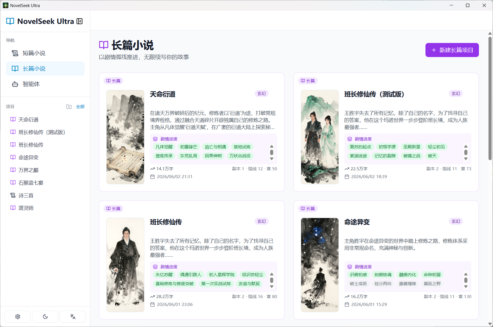

---

## 目录

- [核心特性](#核心特性)
- [快速开始](#快速开始)
- [操作手册](#操作手册)
  - [1. 配置 AI 模型（设置页）](#1-配置-ai-模型设置页)
  - [2. 新建长篇项目](#2-新建长篇项目)
  - [3. 生成大纲与世界观](#3-生成大纲与世界观)
  - [4. 副本 / 剧情弧线管理](#4-副本--剧情弧线管理)
  - [5. 角色管理与立绘](#5-角色管理与立绘)
  - [6. 境界系统](#6-境界系统)
  - [7. 容器知识库（自演化）](#7-容器知识库自演化)
  - [8. 本地知识库 / 索引（RAG）](#8-本地知识库--索引rag)
  - [9. 章节生成页](#9-章节生成页)
  - [10. 写作智能体（Agent）](#10-写作智能体agent)
  - [11. 问小说](#11-问小说)
  - [12. 版本快照](#12-版本快照)
  - [13. 有声朗读（TTS）](#13-有声朗读tts)
  - [14. 电子书导出](#14-电子书导出)
  - [15. 数据备份与恢复（与手机端互通）](#15-数据备份与恢复与手机端互通)
- [截图清单（需要你手动补充）](#截图清单需要你手动补充)
- [技术栈与项目结构](#技术栈与项目结构)
- [Pollinations Attribution](#pollinations-attribution)
- [License](#license)

---

## 核心特性

- **结构化长篇创作**：项目 → 副本（Volume）→ 剧情弧线（Arc）→ 章节，弧线状态「未开始 / 进行中 / 已完成」随写作进度**自动标记**。
- **章节生成页**：本章规划（目标 / 核心冲突）、流式生成、续写、润色、插图模式、段落锚点插图、章节推文配图；章节列表支持重命名、长按拖动排序。
- **写作智能体（Agent）**：ReAct 式自主执行，能新建项目、写大纲、建副本/弧线、规划并逐章生成、管理角色与立绘、生成封面/插图、检索问答等。支持**多会话**、**后台运行**（切换页面不中断）、运行中随时插话、敏感操作确认。
- **修炼境界体系**：自定义大/小境界，注入大纲/弧线/章节生成，保证战力修为一致。
- **容器知识库（自演化）**：按角色 / 按章节 / 不分块三种容器，可勾选「写完章节自动更新」（每写完一章 AI 自动演进各分块的值）与「影响生成」（最新值软引导后续生成）——用于追踪数值、功法、天材地宝、武器、势力关系等。
- **本地知识库（RAG）**：基于 Embedding 的章节索引 + 长程语义检索，规划与生成时注入相关记忆，缓解超长篇上下文遗忘。
- **角色管理**：从大纲导入**详尽**角色档案（性格/动机/背景/外貌/是否主角），角色立绘（大气竖版图片框），关系与事件。
- **问小说**：就当前项目内容提问，结合知识库检索作答。
- **版本快照**：一键存档 / 回退整部项目。
- **有声朗读（TTS）**：Edge 神经语音朗读章节。
- **电子书导出**：`PDF / TXT / EPUB / MOBI`。
- **数据备份与恢复**：导出 / 导入完整备份；格式与手机端 **NovelSeek-Ultra 完全互通**，可在两端无损互导。
- **离线本地**：文本/图片走你自己的 API Key；项目数据存于本机（SQLite + IndexedDB）。

---

## 快速开始

### 环境要求

- Node.js `>= 18`
- Rust `>= 1.75`
- npm
- Windows（主要测试平台）

### 安装与运行

```bash
npm install        # 安装前端依赖
npm run tauri:dev  # 开发模式（首次会编译 Rust，较慢）
```

### 生产构建

```bash
npm run tauri:build
```

安装包默认输出：

- `src-tauri/target/release/bundle/msi/`
- `src-tauri/target/release/bundle/nsis/`

> 升级 / 改名说明：本应用的数据目录由 Tauri 的 `bundle.identifier`（`com.novelseek.pro`）决定（`%APPDATA%\com.novelseek.pro\` 下的 `novelseek.db` 与 WebView2 数据）。**改名为 NovelSeek Ultra 时刻意保留了该 identifier**，以免你已有的项目数据被「孤立」。如需彻底切换 identifier，请先用「数据备份」导出，再在新 identifier 下导入。

---

## 操作手册

> 下面每一步都预留了截图位置（`docs/screenshots/*.png`）。把对应截图放进该目录、文件名对上即可自动显示。文末有完整的[截图清单](#截图清单需要你手动补充)。

### 1. 配置 AI 模型（设置页）

左侧栏进入 **设置**。配置**文本模型平台**（`DeepSeek / OpenAI / OpenRouter / Gemini(OpenAI 兼容) / 自定义`）的 `API Key / API URL / 模型 / Temperature`，可保存多套并切换。图片生成可选填 `Pollinations Key` 或切换 `ComfyUI`。这是其它所有 AI 功能的前置条件。

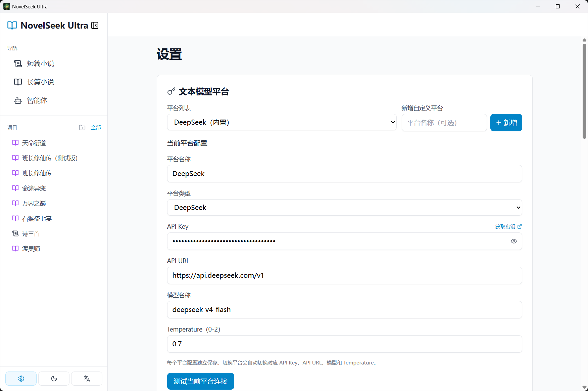

### 2. 新建长篇项目

左侧栏「**长篇小说**」（应用启动默认进入此页）→「**新建长篇项目**」。卡片列表会显示封面、简介（固定 3 行）、剧情进度、字数与「副本 / 弧线 / 章」计数。


### 3. 生成大纲与世界观

进入项目 →「**大纲 / 设定**」。可填写世界观、时间线，并 AI 生成长篇大纲（含副本规划与弧线）。大纲是后续角色导入、弧线、章节规划的基础。

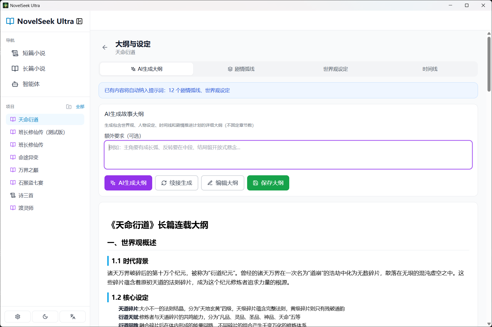

### 4. 副本 / 剧情弧线管理

在项目页或章节生成页的「**副本 / 弧线**」面板：新建/AI 生成副本，在副本内 AI 生成或手动添加弧线，调整顺序，设置弧线进度（未开始/进行中/已完成）。章节归属到「副本 → 弧线」，生成时会注入对应上下文。

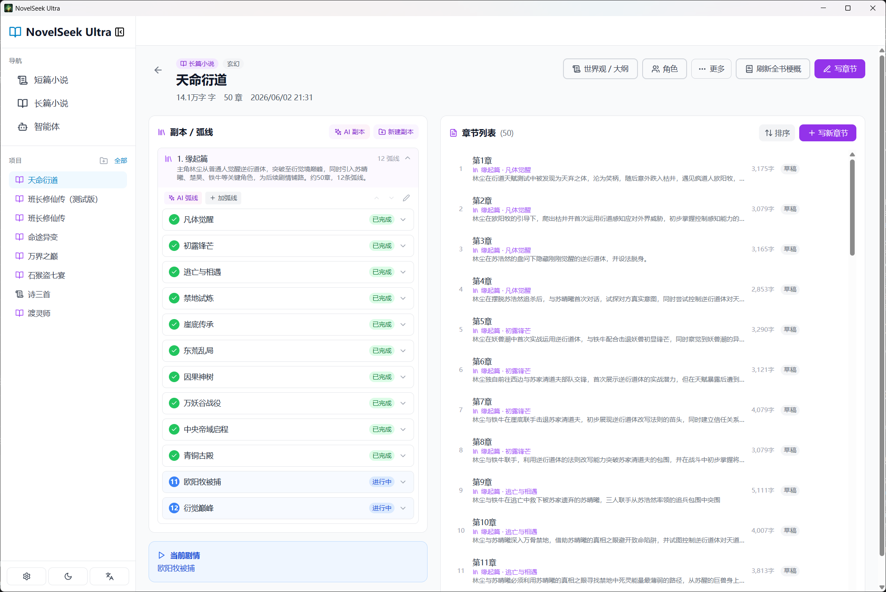

### 5. 角色管理与立绘

进入项目 →「**角色**」。可手动添加，或「**从大纲导入**」——会生成详尽档案（身份/性格/动机/背景/外貌/是否主角）。每个角色以**竖版图片框**展示立绘，可一键生成立绘。


### 6. 境界系统

章节生成页「更多 → 境界系统」或项目页入口。自定义大境界与子境界（层），并为角色指定当前境界。写玄幻/修真建议**先建境界体系**，它会注入大纲/弧线/章节生成。

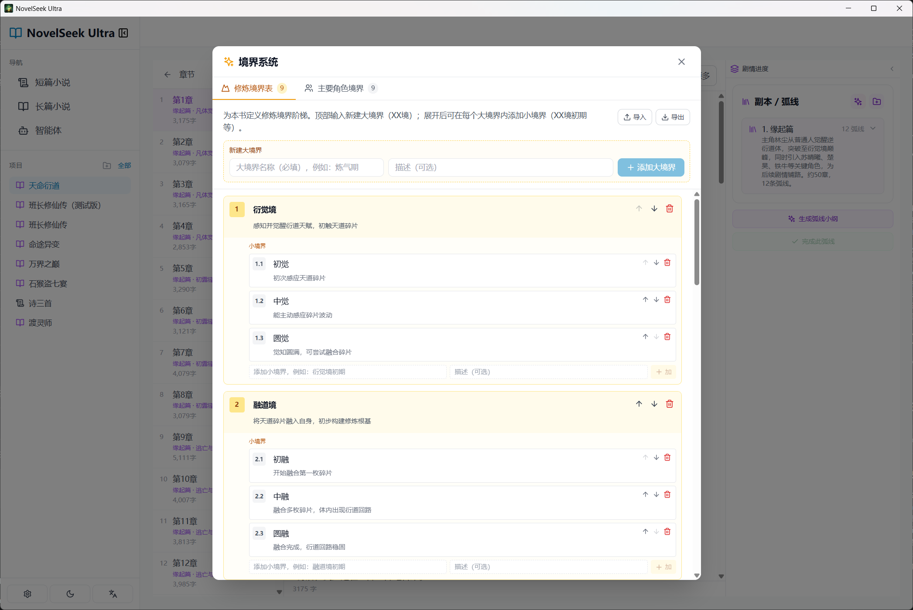

### 7. 容器知识库（自演化）

章节生成页「**更多 → 容器**」进入容器页。新建容器时选择分块方式：
- **按角色分块**（每个角色一个分块）、**按章节分块**、**不分块**；
- 勾选「**写完章节自动更新**」：每写完并保存一章，AI 会基于本章正文为各分块演进出新条目（形成进化链）；
- 勾选「**影响生成**」：把各分块最新值作为软引导注入后续章节生成。

适合追踪「角色修炼数值 / 功法招式 / 天材地宝资源 / 武器 / 副业 / 势力关系」等会随剧情演变的信息。

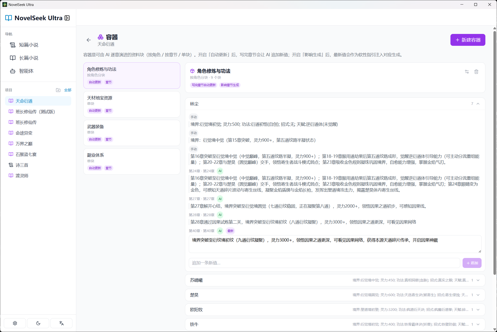

### 8. 本地知识库 / 索引（RAG）

在**设置页**开启「知识库」，配置 Embedding（`API Key / API URL / 模型`），可「重建知识库索引」「生成全部章节摘要」。开启后，章节规划与生成会做语义检索、注入相关记忆，缓解超长篇前后遗忘。

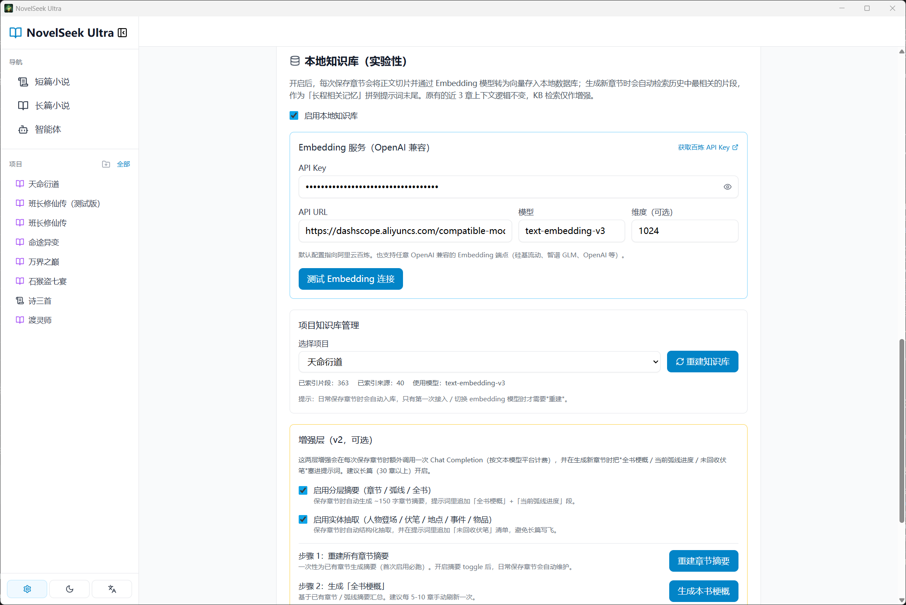

### 9. 章节生成页

项目内点章节进入编辑器：
- **本章规划**（标题 / 本章目标 / 核心冲突），「AI 助填」会读取大纲、所属副本/弧线、世界观/境界、容器知识库、本地知识库检索与前文后再规划；
- **流式生成 / 续写 / 润色**，正文实时显示（限高可滚）；
- **插图模式**：选段落锚点生成插图；「更多」里有容器、境界、推文配图等；
- 新建章节可选择归属的副本/弧线，序号自动排到该弧线最后一章之后；
- 后台 Agent 新生成的章节会**自动出现在左侧列表**，无需退出重进。

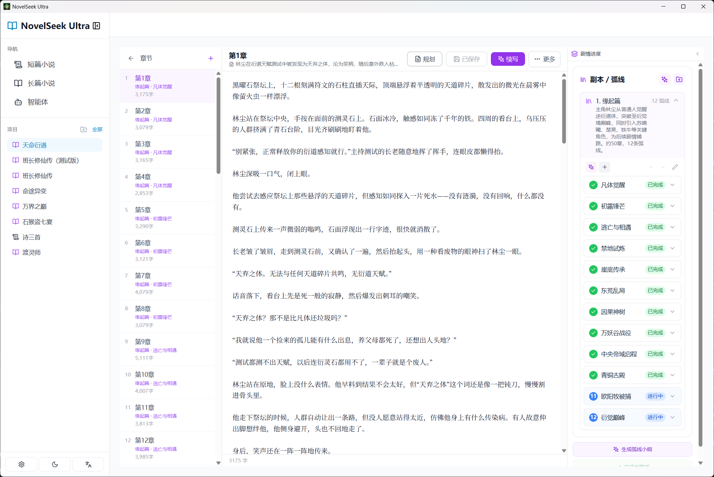

### 10. 写作智能体（Agent）

左侧栏「**智能体**」。用一句话描述目标（如「新建一部仙侠长篇，建境界体系，生成大纲与 3 个副本，为第一个副本生成弧线并规划前 5 章，然后写第 1 章」），它会自主分步执行并展示每一步。

- **多会话**：右上角切换 / 新建 / 重命名 / 删除会话，各会话独立持久化；
- **后台运行**：运行中切到其它页面不中断，侧栏「智能体」入口有运行指示；
- **随时插话**：运行中也可在输入框追加指令；敏感操作会先请你确认（也可勾选「自动批准」）。

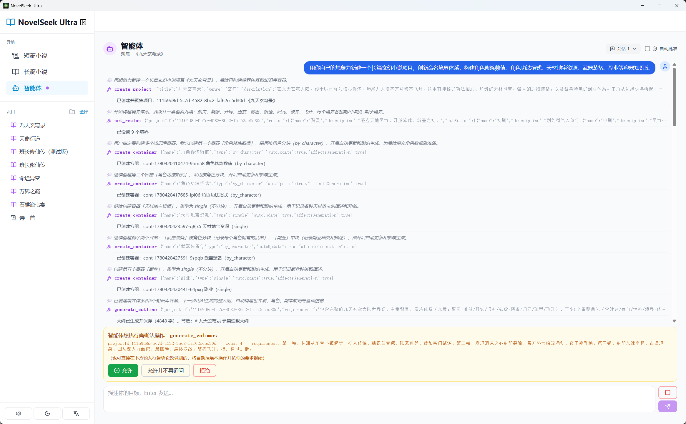

### 11. 问小说

项目内「问小说」入口。就当前项目内容提问，结合本地知识库检索作答；对话历史按项目持久化。


### 12. 版本快照

项目内「历史 / 快照」入口。可保存当前项目为版本快照、重命名、回退（回退前建议先存档）。


### 13. 有声朗读（TTS）

项目内「朗读 / 有声书」入口。用 Edge 神经语音朗读章节，可选音色与语速。

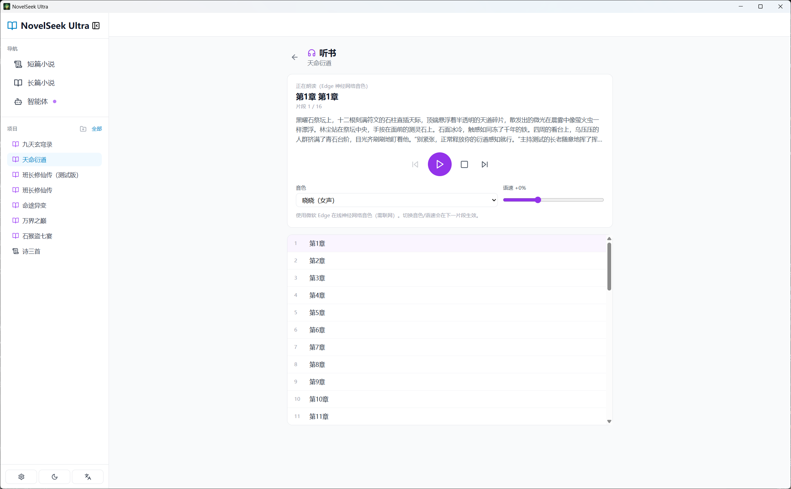

### 14. 电子书导出

章节列表页「**导出电子书**」。支持 `PDF`（含封面/章节封面/段落插图）、`TXT / EPUB / MOBI`（纯文本）。导出预览可删除个别插图，设置会持久化。

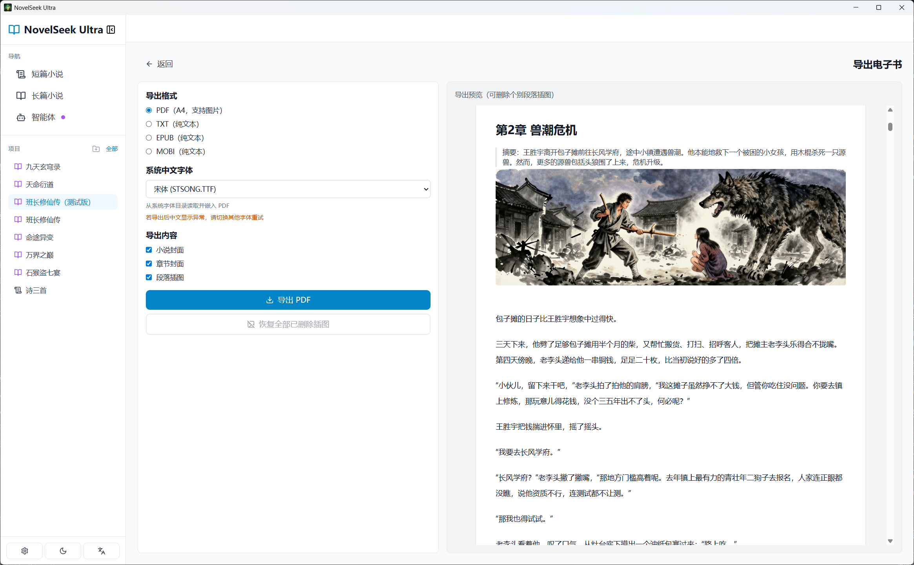

### 15. 数据备份与恢复（与手机端互通）

设置页「**数据备份**」：
- **导出**：生成完整备份 JSON（项目 / 章节正文 / 插图 / 立绘 / 封面 / 全部 *ByProject 映射 / 容器 / 副本 / 成长 / 问小说 / 设置），图片按手机端约定写为裸 base64；
- **导入**：选择备份 JSON，可勾选是否覆盖应用设置（含 API Key）。

> ✅ 该格式与手机端 **NovelSeek-Ultra** 完全互通：手机端导出的备份可直接在 PC 导入，反之亦然。

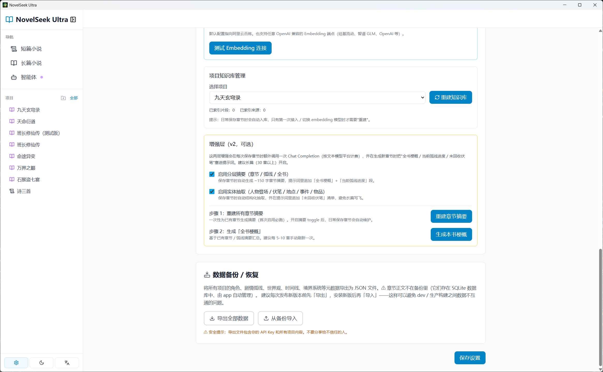

---

## 技术栈与项目结构

**技术栈**：`Tauri 1.x` · `React 18 + TypeScript + Vite` · `Zustand`（持久化到 IndexedDB）· `Tailwind CSS` · `Rust + SQLite(sqlx)`。

```text
NovelSeek-Ultra-PC/
├─ src/
│  ├─ agent/           # 写作智能体：运行器/工具/提示词/多会话
│  ├─ components/      # 通用 UI 组件
│  ├─ pages/           # 页面：长篇主页/项目/大纲/编辑/角色/容器/问小说/快照/朗读/导出/设置
│  ├─ services/        # 前端 API 封装
│  ├─ store/           # Zustand 全局状态（含持久化）
│  ├─ types/           # TypeScript 类型
│  └─ utils/           # 工具（容器/境界/知识库/快照等）
├─ src-tauri/
│  ├─ src/
│  │  ├─ api/          # DeepSeek / Pollinations / ComfyUI 调用层
│  │  ├─ commands/     # Tauri 命令（含流式生成、TTS、备份内容导入导出）
│  │  ├─ db/           # SQLite 初始化与迁移
│  │  └─ services/     # 后端业务服务
│  └─ tauri.conf.json
├─ docs/screenshots/   # 操作手册截图（本 README 引用）
├─ package.json
├─ README.md / README.en.md
└─ DEVELOPMENT.md / QUICKSTART.md / API_EXAMPLES.md
```

---

## Pollinations Attribution

- 官方网站：<https://pollinations.ai>

[](https://pollinations.ai)

---

## License

MIT
